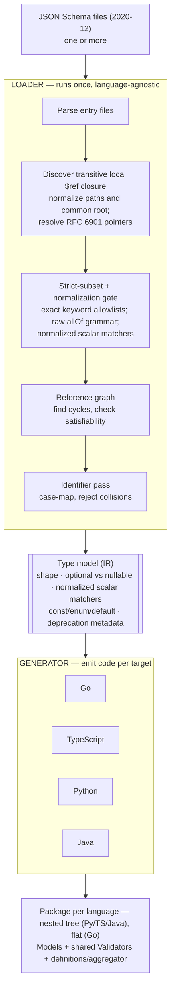
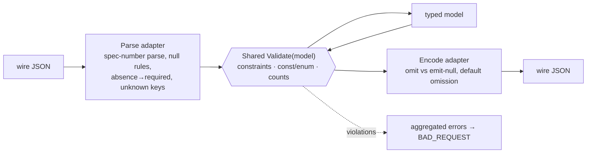

# Loader → Generator pipeline

A set of JSON Schema files becomes model code in four languages. The
loader is language-agnostic: it parses, enforces the strict subset, and
lowers everything to one shared type model. The generator emits that model
for each target. The per-file document concerns the Parse step decides
first — the two file modes and the `nexusrpc` / `$schema` root rules —
live in [[input-files]]. See [PRINCIPLES.md](PRINCIPLES.md) and
`features/<keyword>.md` for detail.

Parse begins from the explicitly supplied entry files. The loader follows local
`$ref` edges to a fixpoint, canonicalizes and deduplicates the discovered files,
then computes one common source root for the complete closure. Fragments are
resolved as RFC 6901 JSON Pointers: every token is decoded independently
(`~0`/`~1`), including pointers through nested `$defs`. A bare `#/` is not a
synonym for the document root and is rejected.

Each source in that closure marks its exported type declarations: its file-root
model when present, every referenced model in its `$defs` tree, and source-owned
models synthesized for inline operation inputs or outputs. This neutral
declaration metadata travels with the shared IR into reachability. Later shared
passes do not identify JSON Schema declarations or infer a source's public
surface from external-type kind.

## Runtime validators

The JSON Schema constraint-planning layer represents the scalar predicate set
once—kind, numeric bounds, length, pattern, asserted format, `const`, and
`enum`. `contains`, `propertyNames`, ordinary field validation, and validation
of closed/default literals all consume that normalized description. Backends
still own syntax and native materialization, but they do not independently
choose which accepted assertions apply.

Every (de)serializer is three layers around one shared `Validate(model)`,
identical in both directions.

